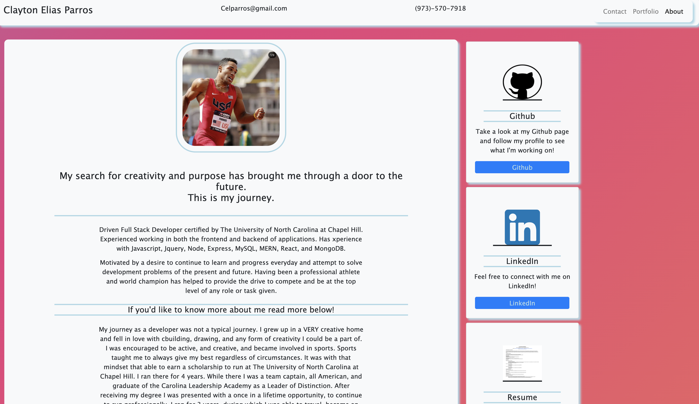

# cparros.github.io
This is my personal website. 

It was started in the UNC Coding Bootcamp as a way to work on Bootstrap and Semantic HTML. I am continually working on upgrading and experimenting with features and adding Semantics. 

I was given Screenshots to "mimic" although the site didnt need to look exactly like the Screenshots. This was an excellent exercise and I am excited to continue working on it!

Currently learning Java script so burger nav on smaller screens will have funcitonality.

WORKING ON SEMANTIC HTML

Link to Portfolio Site: https://cparros.github.io/

